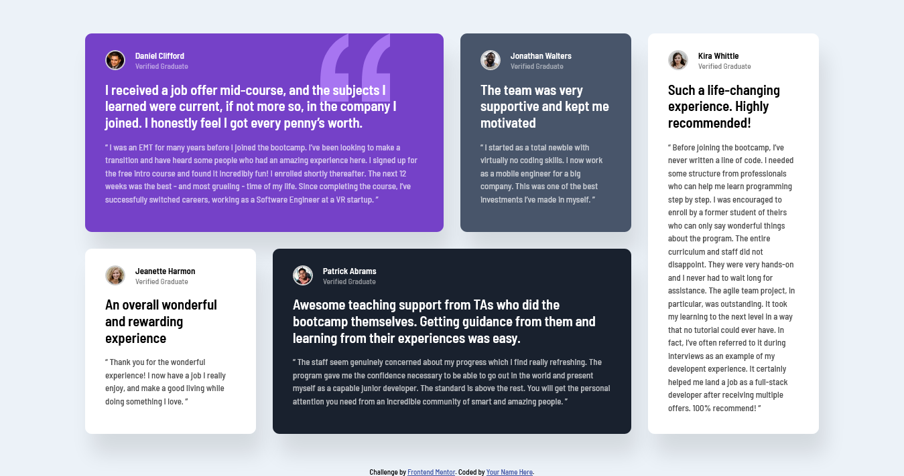

# Frontend Mentor - Testimonials grid section solution

This is a solution to the [Testimonials grid section challenge on Frontend Mentor](https://www.frontendmentor.io/challenges/testimonials-grid-section-Nnw6J7Un7). Frontend Mentor challenges help you improve your coding skills by building realistic projects. 

## Table of contents

- [Overview](#overview)
  - [The challenge](#the-challenge)
  - [Screenshot](#screenshot)
  - [Links](#links)
- [My process](#my-process)
  - [Built with](#built-with)
  - [What I learned](#what-i-learned)
- [Author](#author)

## Overview

### The challenge

Users should be able to:

- View the optimal layout for the site depending on their device's screen size

### Screenshot



### Links

- Solution URL: [Github Repository](https://github.com/antonio-barrera/testimonials-grid-section-main)
- Live Site URL: [Github Page](https://antonio-barrera.github.io/testimonials-grid-section-main/)

## My process

### Built with

- Semantic HTML5 markup
- CSS custom properties
- Flexbox
- CSS Grid
- Mobile-first workflow

### What I learned

The grid container is a very useful tool to make responsive webpages easily for any kind of screensizes.

```css
.grid-container {
  display: grid;
  grid-template-columns: repeat(3, 30rem);
}

@media (max-width: 375px) {
  .grid-container {
    grid-template-columns: 30rem;
  }
}
```

## Author

- Frontend Mentor - [@antonio-barrera](https://www.frontendmentor.io/profile/antonio-barrera)
- Twitter - [@soyantoniob](https://www.twitter.com/soyantoniob)